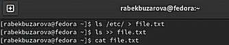
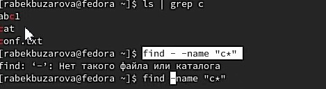
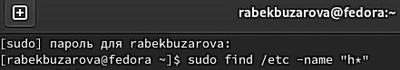
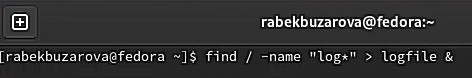

**Лабораторная работа**

Бекбузарова Роза – студентка группы НФИбд-01-21

07.05.2022

***

Поиск файлов. Перенаправление ввода-вывода.

Просмотр запущенных процессов

---

Ознакомление с инструментами поиска файлов и

фильтрации текстовых данных. Приобретение

практических навыков: по управлению

процессами (и заданиями), по проверке

использования диска и обслуживанию файловых

систем

---

\1. Запишите в файл file.txt название файлов,

содержащихся в к аталоге ,etc. Допишите в этот

же файл названия файлов, содержащихся в

вашем домашнем к аталоге

___

\2. Выведите имена всех файлов из file.txt,

имеющих расширение .conf, после чего

запишите их в новый текстовый файл conf.txt.

---

\3. Определите, какие файлы в вашем домашнем

к аталоге имеют имена, начинающиейся с

си мвола с? Предложите н есколь ко вари ан тов, как

это сделать.

---

\4. Выведите на экран имена файлов из к аталога

/etc, начинающиеся с символа h.

---

\5. Запустите в фоновом режиме процесс, к оторый

буд ет записывать в файл ~/logfile файлы, имена

к оторых начинаются с log.

---

\6. Удалите файл ~/logfile. Запустите из к онс оли в

фоновом режиме редактор gedit

---

\7. Определите идентификатор процесса gedit,

используя команду ps, конвейер и фильтр grep.

Как ещё можно определить идентификатор

процесса? Прочтите справку (man) команды kill,

после чего используйте ее для завершения

процесса gedit.

---

\8. Выполните команды df du, предварительно

получив более подробную информацию об этих

командах, с помощью команды man.

---

9.Воспользовавшись справкой команды find,

выведите имена всех директорий, имеющихся в

вашем домашнем каталоге.

---

Ознакомились с инструментами поиска файлов и

фильтрации текстовых данных. Приобрели

практические навыки по управлению

процессами (и заданиями), по проверке

использования диска и обслуживанию файловых 
систем.

